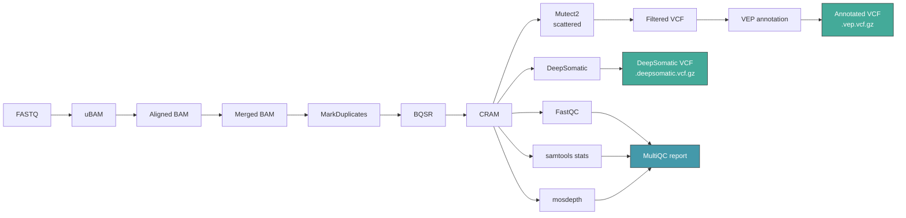

# ctgflow

[](https://github.com/CTGlab/ctgflow/actions/workflows/testing.yml)
[](https://snakemake.github.io)
[](LICENSE)

A Snakemake-based somatic variant calling pipeline for whole exome (WES) and whole genome (WGS) sequencing data, implementing GATK Best Practices. Supports tumor-only and tumor-normal modes with multiple variant callers (Mutect2 + DeepSomatic) and comprehensive quality control.

Developed by the [Computational and Translational Genomics Lab](https://github.com/CTGlab).

## Pipeline overview



## Features

- **Dual variant callers** — Mutect2 (GATK) and Google DeepSomatic run in parallel
- **Tumor-only and tumor-normal** modes controlled by a single config flag
- **Scatter-gather parallelism** for Mutect2 and BQSR across genomic intervals
- **VEP annotation** of somatic variants
- **Comprehensive QC** with FastQC, samtools stats, mosdepth, and MultiQC
- **CRAM output** for storage-efficient final alignments
- **SLURM support** via Snakemake profiles for HPC execution
- **Fully containerized** with Docker/Singularity, or per-rule Conda environments
- **CI-tested** with a chr22 integration test suite

## Requirements

- [Snakemake](https://snakemake.github.io) >= 8.0
- [Conda](https://docs.conda.io) (for per-rule environments) or [Singularity/Apptainer](https://apptainer.org) (for containers)

## Quick start

```bash
# 1. Clone the repository
git clone https://github.com/CTGlab/ctgflow.git
cd ctgflow

# 2. Prepare input files (see Input data section below)
#    Edit units.csv and config/config_main.yaml

# 3. Dry run to validate
snakemake -n

# 4. Run with Conda environments
snakemake --cores 8 --use-conda --conda-cleanup-pkgs cache

# 5. Or run with Singularity containers
snakemake --use-singularity -j 8
```

## Input data

The pipeline is driven by a units CSV file and a configuration file. Patient identifiers are extracted automatically from the `patient` column in `units.csv`.

### units.csv

One row per sequencing unit (read group). Multiplexed samples have multiple rows:

| Column | Description | Values |
|--------|-------------|--------|
| `patient` | Patient identifier, must match patients.csv | — |
| `sample` | Sample type | `tumor` or `normal` |
| `platform` | Sequencing platform | `ILLUMINA` |
| `readgroup` | Read group identifier | e.g. `rg01`, `rg02` |
| `fq1` | Path to forward FASTQ (gzipped) | absolute path |
| `fq2` | Path to reverse FASTQ (gzipped) | absolute path |
| `seqtype` | Sequencing type | `WES` or `WGS` |

Example with a tumor-only patient (2 lanes) and a tumor-normal pair:

```csv
patient,sample,platform,readgroup,fq1,fq2,seqtype
patientA,tumor,ILLUMINA,rg01,/path/to/patientA_tumor_L001_R1.fastq.gz,/path/to/patientA_tumor_L001_R2.fastq.gz,WES
patientA,tumor,ILLUMINA,rg02,/path/to/patientA_tumor_L002_R1.fastq.gz,/path/to/patientA_tumor_L002_R2.fastq.gz,WES
patientB,tumor,ILLUMINA,rg01,/path/to/patientB_tumor_R1.fastq.gz,/path/to/patientB_tumor_R2.fastq.gz,WES
patientB,normal,ILLUMINA,rg01,/path/to/patientB_normal_R1.fastq.gz,/path/to/patientB_normal_R2.fastq.gz,WES
```

Both files are validated against JSON schemas in `workflow/schemas/`.

## Configuration

Edit `config/config_main.yaml` to set paths and parameters. Key settings:

```yaml
sequencing_type: "WES"        # "WES" or "WGS"
tumor_only: true              # true for tumor-only, false for tumor-normal pairs

output_folder: "/path/to/output/"
tmp_dir: "/path/to/temp/"
log_folder: "/path/to/logs/"
```

### Reference resources

The pipeline requires several reference files. Download them before running:

| Resource | Source |
|----------|--------|
| GRCh38 reference genome | [GIAB](https://ftp-trace.ncbi.nlm.nih.gov/ReferenceSamples/giab/release/references/GRCh38/GRCh38_GIABv3_no_alt_analysis_set_maskedGRC_decoys_MAP2K3_KMT2C_KCNJ18.fasta.gz) |
| dbSNP 146 | [Broad Resource Bundle](ftp://gsapubftp-anonymous@ftp.broadinstitute.org/bundle/hg38/dbsnp_146.hg38.vcf.gz) |
| Known indels | [Google Cloud](https://storage.googleapis.com/genomics-public-data/resources/broad/hg38/v0/Homo_sapiens_assembly38.known_indels.vcf.gz) |
| 1000G Phase 1 SNPs | [Google Cloud](https://storage.googleapis.com/genomics-public-data/resources/broad/hg38/v0/1000G_phase1.snps.high_confidence.hg38.vcf.gz) |
| gnomAD AF-only | [GATK Best Practices](https://storage.googleapis.com/gatk-best-practices/somatic-hg38/af-only-gnomad.hg38.vcf.gz) |
| ExAC common (contamination) | [GATK Best Practices](https://storage.googleapis.com/gatk-best-practices/somatic-hg38/small_exac_common_3.hg38.vcf.gz) |
| VEP cache | [Ensembl VEP](https://uswest.ensembl.org/info/docs/tools/vep/script/vep_cache.html#cache) |

You also need a BED file with target regions — for WES this is the capture kit regions; for WGS use a calling regions file from the GATK Resource Bundle.

### Variant caller parameters

Mutect2 and DeepSomatic parameters are configured under the `params` section:

```yaml
params:
  mutect2:
    num_workers: 10              # scatter-gather parallelism
    args: --max-population-af 0.05 --dont-use-soft-clipped-bases
    filtering: --unique-alt-read-count 2 --min-reads-per-strand 1
  deepsomatic:
    threads: 4
    model_type: "WES"            # must match sequencing_type
```

## Outputs

| Output | Path | Description |
|--------|------|-------------|
| Annotated VCFs | `vcfs/{patient}.vep.vcf.gz` | Mutect2 calls with VEP annotation |
| DeepSomatic VCFs | `vcfs/{patient}.deepsomatic.vcf.gz` | DeepSomatic variant calls |
| Filtered VCFs | `vcfs/{patient}.filtered.vcf.gz` | Mutect2 calls before VEP |
| CRAM files | `cram/{patient}.{sample_type}.cram` | Final aligned reads |
| MultiQC report | `qc/multiqc_report.html` | Aggregated QC metrics |

All outputs are written under the `output_folder` specified in the config.

## Cluster execution (SLURM)

A SLURM profile template is provided in `workflow/profile/slurm/config.yaml`:

```yaml
default-resources:
    slurm_account: "<your_account>"
    slurm_partition: "<your_partition>"
    mem_mb_per_cpu: 1800
    runtime: "30m"
```

Run on a SLURM cluster with:

```bash
snakemake --use-conda --profile workflow/profile/slurm/ -j 100
```

Override resources for specific rules using `set-resources` and `set-threads` in the profile config.

## Scatter-gather parallelism

Mutect2 and BQSR scatter across genomic intervals generated by GATK's `SplitIntervals`. The `num_workers` parameter controls the number of scatter chunks. Intervals use zero-padded names (`0000`, `0001`, ...) and results are gathered by dedicated merge rules. This is the primary mechanism for HPC parallelism.

For WES data, GATK can split into many subregions (tested up to 50 workers). For WGS with the Broad calling regions file, GATK may cap at ~24 subregions.

## Project structure

```
ctgflow/
├── config/
│   └── config_main.yaml          # Primary configuration
├── workflow/
│   ├── Snakefile                  # Main entry point
│   ├── rules/
│   │   ├── common.smk            # Shared helpers and config loading
│   │   ├── alignment.smk         # FASTQ → aligned BAM
│   │   ├── preprocessing.smk     # BQSR, BAM → CRAM
│   │   ├── somatic.smk           # Mutect2 scatter/gather + filtering
│   │   ├── deepsomatic.smk       # DeepSomatic variant calling
│   │   ├── qc.smk                # FastQC, samtools, mosdepth, MultiQC
│   │   └── pon.smk               # Panel of Normals (optional)
│   ├── envs/                     # Per-rule Conda environments
│   ├── schemas/                  # JSON schemas for config/input validation
│   └── profile/slurm/            # SLURM cluster profile
├── .test/                        # Integration test suite (chr22)
├── units.csv                     # Template units file
└── citations.md                  # Software citations
```

## Testing

The test suite in `.test/` uses a reduced chr22 dataset for fast CI execution:

```bash
cd .test
snakemake --cores 1 --use-conda --conda-cleanup-pkgs cache
```

Linting:

```bash
snakemake --lint
```

CI runs both linting and integration tests on every push to `master` and on pull requests.

## Containers and environments

The pipeline supports two execution modes:

**Conda** (recommended for development): per-rule Conda environments in `workflow/envs/` are automatically created by Snakemake with `--use-conda`.

**Singularity/Apptainer** (recommended for production): pre-built containers for full reproducibility with `--use-singularity`.

| Container | Image |
|-----------|-------|
| Core tools (GATK, BWA, samtools) | `docker://danilotat/ctgflow_core` |
| DeepVariant | `docker://google/deepvariant:1.8.0` |
| DeepSomatic | `docker://google/deepsomatic:1.8.0` |

## Troubleshooting

### FASTQ formatting

The first line of each read (sequence identifier) must be a single string without spaces. Identifiers like `@MGILLUMINA4_74:7:1101:10000:100149` are correct. Space-separated identifiers will cause `Aligned record iterator is behind the unmapped reads` errors because GATK and BWA parse them differently.

### Storage

Ensure at least 20 GB of free storage for Singularity containers (~8 GB) plus intermediate and output files. The pipeline uses `temp()` extensively to clean up intermediates, and final alignments are stored as CRAMs for compression efficiency.

## Citations

If you use ctgflow, please cite the following tools:

- **GATK** — Van der Auwera et al., 2013. *Current Protocols in Bioinformatics*. [doi:10.1002/0471250953.bi1110s43](https://doi.org/10.1002/0471250953.bi1110s43)
- **Mutect2** — Benjamin et al., 2019. *bioRxiv*. [doi:10.1101/861054](https://doi.org/10.1101/861054)
- **VEP** — McLaren et al., 2016. *Genome Biology*. [doi:10.1186/s13059-016-0974-4](https://doi.org/10.1186/s13059-016-0974-4)
- **Snakemake** — Koster & Rahmann, 2012. *Bioinformatics*. [doi:10.1093/bioinformatics/bts480](https://doi.org/10.1093/bioinformatics/bts480)
- **samtools** — Li et al., 2009. *Bioinformatics*. [doi:10.1093/bioinformatics/btp352](https://doi.org/10.1093/bioinformatics/btp352)
- **MultiQC** — Ewels et al., 2016. *Bioinformatics*. [doi:10.1093/bioinformatics/btw354](https://doi.org/10.1093/bioinformatics/btw354)
- **mosdepth** — Pedersen & Quinlan, 2018. *Bioinformatics*. [doi:10.1093/bioinformatics/btx699](https://doi.org/10.1093/bioinformatics/btx699)
- **FastQC** — Andrews, 2020. [github.com/s-andrews/FastQC](https://github.com/s-andrews/FastQC)

## License

[MIT](LICENSE) — Copyright (c) 2025 Computational and Translational Genomics Lab
